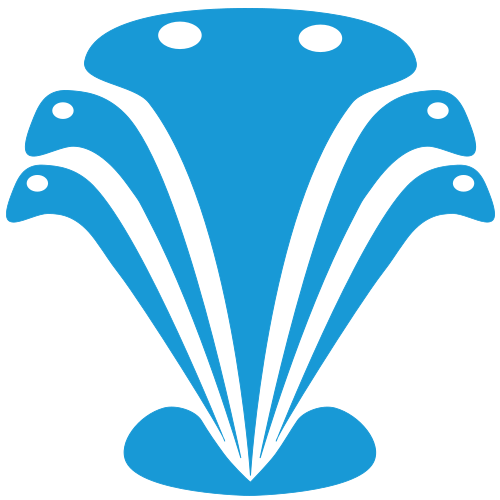
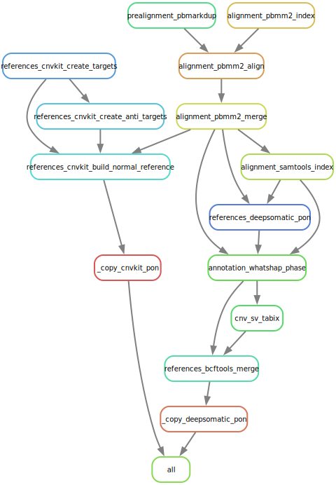

#  hydra-genetics/build_pon

#### Create PoN for CNVkit and DeepSomatic


[](https://opensource.org/licenses/gpl-3.0.html)

## :speech_balloon: Introduction

The module consists of steps required for building "panel of normals" (PoN, pon) for CNVkit and DeepSomatic.

## :heavy_exclamation_mark: Dependencies

In order to use this module, the following dependencies are required:

[](https://github.com/hydra-genetics/)
[](https://pandas.pydata.org/)
[
[](https://snakemake.readthedocs.io/en/stable/)
[](https://sylabs.io/docs/)

## :school_satchel: Preparations

### Sample data

Input data should be added to [`samples.tsv`](https://github.com/hydra-genetics/cnvkit_pon/blob/develop/config/samples.tsv)
and [`units.tsv`](https://github.com/hydra-genetics/cnvkit_pon/blob/develop/config/units.tsv).
The following information need to be added to these files:

| Column Id         | Description                                                                                |
|-------------------|--------------------------------------------------------------------------------------------|
| **`samples.tsv`** |
| sample            | unique sample, one per row                                                                 |
| **`units.tsv`**   |
| sample            | same sample id as in `samples.tsv`                                                         |
| type              | data type identifier (one letter - N)                                                      |
| platform          | type of sequencing platform, e.g. `PacBio`                                                 |
| machine           | specific machine id, e.g. `Revio`                                                          |
| barcode           | a character string, must not be `NA` (will be dropped in future releases of Hydra-Genetics |
| bam               | absolute path to reads in BAM format                                                       |

## :white_check_mark: Testing

The workflow repository contains a small test dataset `.tests/integration` which can be run like so:

```bash
$ cd .tests/integration
$ snakemake -s ../../Snakefile --configfiles ../../config/config.yaml config/config.yaml -j1 --use-singularity
```
`../../config/config.yaml` is the original config-file, while `config/config.yaml` is the test config. By defining two config-files the latter overwrites any overlapping variables in the first config-file.

## :rocket: Usage

To use this workflow, follow the description in the
[snakemake docs](https://snakemake.readthedocs.io/en/stable/executing/cli.html).

### Output files

The following output files should be targeted via another rule:

| File                                                             | Description                      |
|------------------------------------------------------------------|----------------------------------|
| `build_pon/results/cnvkit_build_normal_reference/cnvkit.PoN.cnn` | PoN file to use with CNVkit      |
| `build_pon/results/bcftools_merge/normal_db.vcf.gz`              | PoN file to use with DeepSomatic |

## :judge: Rule Graph
