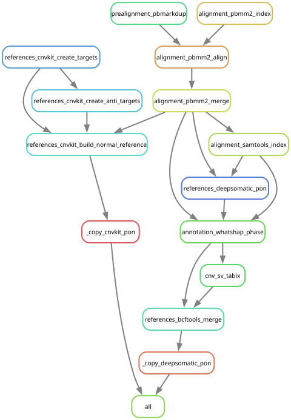

#  PoN Builder

#### Create Panel of Normals for CNVkit, Jumble, DeepSomatic, and SVDB (using Sniffles2, PBSV and Severus)


[](https://opensource.org/licenses/gpl-3.0.html)

## :speech_balloon: Introduction

Builds Panel of Normals (PoN) files from PacBio HiFi (REVIO) normal samples for use with:

- **CNVkit** — copy number variation analysis
- **Jumble** — copy number variation analysis
- **DeepSomatic** — small variant calling
- **PBSV**, **Severus** and **Sniffles2** — structural variant calling

Also produces a MultiQC QC report (coverage, alignment metrics, per-read QC).

## :heavy_exclamation_mark: Dependencies

All dependencies are managed by [pixi](https://pixi.sh). Install pixi, then run:

```bash
pixi install
```

This resolves and installs all required packages (Python, Snakemake, hydra-genetics, and other tools) as defined in `pixi.toml`. Container images for individual pipeline tools are pulled automatically at runtime via Singularity/Apptainer and are listed in `config/config.yaml`.

## :school_satchel: Preparations

### Sample data

Input data should be added to [`config/samples.tsv`](config/samples.tsv) and [`config/units.tsv`](config/units.tsv). Both files can be made using `hydra-genetics create-input-files` command.

| Column | File | Description |
|--------|------|-------------|
| `sample` | `samples.tsv` | Unique sample ID, one per row |
| `sample` | `units.tsv` | Same sample ID as in `samples.tsv` |
| `type` | `units.tsv` | Must be `N` (normal) |
| `platform` | `units.tsv` | Sequencing platform, e.g. `PACBIO` |
| `machine` | `units.tsv` | Machine model, e.g. `REVIO` |
| `processing_unit` | `units.tsv` | Run/flowcell identifier |
| `barcode` | `units.tsv` | Barcode string (must not be `NA`) |
| `methylation` | `units.tsv` | Whether methylation data is present (`Yes`/`No`) |
| `bam` | `units.tsv` | Absolute path to input BAM file |

### Reference data

The following reference files must be configured in `config/config.yaml` under the `reference` key:

| Key | Description |
|-----|-------------|
| `fasta` | Reference genome FASTA |
| `fai` | FASTA index (`.fai`) |
| `design_bed` | Capture design BED file |
| `trf` | Tandem repeat file for PBSV (`.bed`) |
| `mappability` | Mappability file for CNVkit |
| `severus_pon` | 1000 genomes database used by Severus to filter out normal variants (`.tsv.gz`) |
| `jumble_annotation` | Gene annotation for `jumble-reference.R` (`.RDS`), see below |

#### Jumble annotation

`jumble_reference.annotation` is passed to `jumble-reference.R -a` and must be either the literal
string `"biomart"` (Jumble then fetches gene and exon coordinates from Ensembl, so the compute node
needs outbound network access) or an absolute path to a pre-built annotation `.RDS` file. Anything
else is rejected by Jumble with `Invalid annotation source.`. The default config points it at
`reference.jumble_annotation`.

##### Building the annotation `.RDS`

The annotation is not built from any of your data — it is a one-off fetch from Ensembl merged with
the `cancer_genes.csv` bundled inside the Jumble package. Use
[`scripts/build_jumble_annotation.R`](scripts/build_jumble_annotation.R), on any host with internet
access (a laptop is fine — the result is machine-independent):

```bash
docker run --rm --platform linux/amd64 \
  -v "$PWD/scripts":/scripts:ro -v "$HOME/jumble_annotation":/out \
  hydragenetics/jumble:0.5.0 \
  Rscript /scripts/build_jumble_annotation.R /out/jumble_gene_annotation_hg38.RDS
```

`--platform linux/amd64` is needed on Apple Silicon — the image has no arm64 variant. On the cluster,
swap in `singularity exec -B /beegfs-storage docker://hydragenetics/jumble:0.5.0 Rscript ...`, keeping
all container options *before* the image name. Then copy the `.RDS` to the path
`reference.jumble_annotation` points at.

Do **not** call `Jumble:::generate_gene_annotation()` directly: it lets biomaRt choose an Ensembl
mirror, and as of 2026-09-03 `useast` returns 502 and `asia` returns 404 for `/biomart/martservice`,
so it fails with `Unable to query any Ensembl site` even on an unrestricted network. Passing `host=`
is not enough either — biomaRt refills the Mart host slot from Ensembl's registry, which advertises
`www.ensembl.org`, and that gateway rejects the query POST with `405 Method Not Allowed`. The script
pins the host *and* overrides the slot afterwards. Both the host and the genome are script arguments
(`... build_jumble_annotation.R <out.RDS> <host> <genome>`), so when the mirrors recover or the
archive host rolls over to a new date, no edit is needed.

The script hard-errors if any of chromosomes 1-22, X, Y came back empty — Jumble's own fetch only
emits a warning there, which would silently save a partial annotation. A good hg38 run reports
roughly 20,000 genes and 1.26 M exons. To re-check an existing file:

```r
a <- readRDS("jumble_gene_annotation_hg38.RDS")
str(a, max.level = 1)                                 # list of 3 data.tables
sort(unique(a$allgenes$`Chromosome/scaffold name`))   # expect 1-22, X, Y
nrow(a$allgenes); nrow(a$allexons)
```

The object must be a list named exactly `cancergenes_clinseq`, `allgenes` and `allexons` —
`build_reference()` copies those three fields straight into the PoN. That also means an **existing
Jumble PoN already contains the annotation**: if a colleague has an hg38 `*.reference.RDS` on shared
storage, extract those three fields from it instead of refetching from Ensembl.

The file pins one Ensembl release, which is the reason to prefer it over `"biomart"`. Consider
putting the release or build date in the filename so a rebuild is traceable.


## :white_check_mark: Testing

Unit tests:

```bash
pixi run tests
```

## :rocket: Usage

Dry-run to validate the DAG:

```bash
pixi run all-dry
```

Full run on a SLURM cluster:

```bash
pixi run all-full
```

### Important configuration information

Bin size for CNVkit rules can be specified under `extra` key in `config/config.yaml`, for instance:

```yaml
cnvkit_create_targets:
    extra: "-a 2000"

cnvkit_build_normal_reference:
    extra: "--target-avg-size 2000"
```

### Output files

| File | Description |
|------|-------------|
| `results/cnvkit_build_normal_reference/cnvkit.PoN.cnn` | PoN for CNVkit (copy number) |
| `results/jumble_build_normal_reference/jumble.PoN.RDS` | PoN for Jumble (copy number) |
| `results/bcftools_merge/snv_normal.vcf.gz` | PoN for DeepSomatic (small variants) |
| `results/bcftools_merge/sv_normal.vcf.gz` | Merged SV calls from PBSV, Severus and Sniffles2 |
| `results/qc/multiqc/multiqc_design2.html` | MultiQC report |

## :judge: Rule Graph

